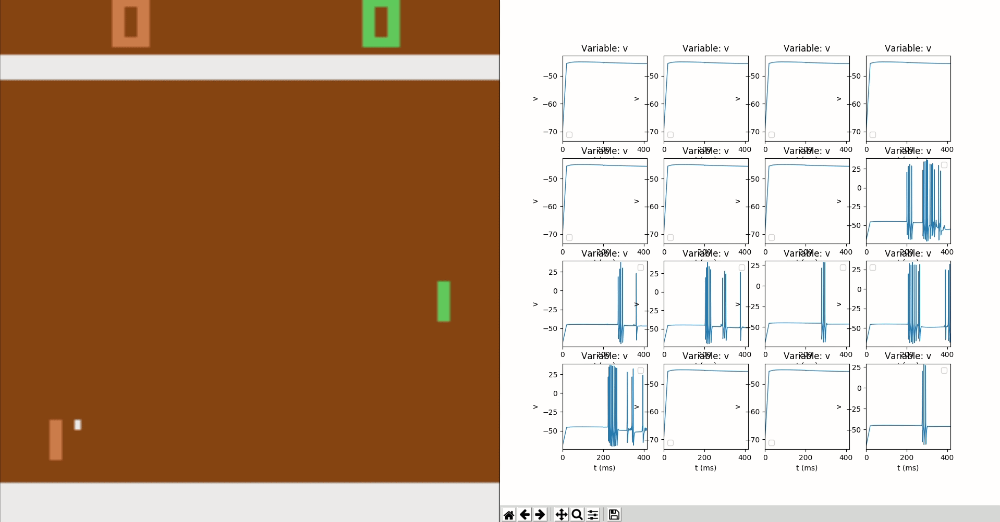

Spiking Neural Gym agent created on top of NEURON++ and OpenAI Gym libraries

## Prerequisites

* Python 3.6

* Install requirements.txt

* Install NEURON from the instruction: https://github.com/ziemowit-s/neuron_get_started

* Install OpenAI Gym Atari environments
    ```bash
    pip install gym[atari]
    ```
    
## Run

* pong_gym_run.py
* mnist_run.py

### Example Usage
 
Example of Atari PONG game (left) and visual receptive fields inputs (right) to pixels' changes
    
### Known issues:

* After a long run it may terminate with:
```bash
terminate called after throwing an instance of 'std::bad_alloc'
  what():  std::bad_alloc

Process finished with exit code 134 (interrupted by signal 6: SIGABRT)
```

